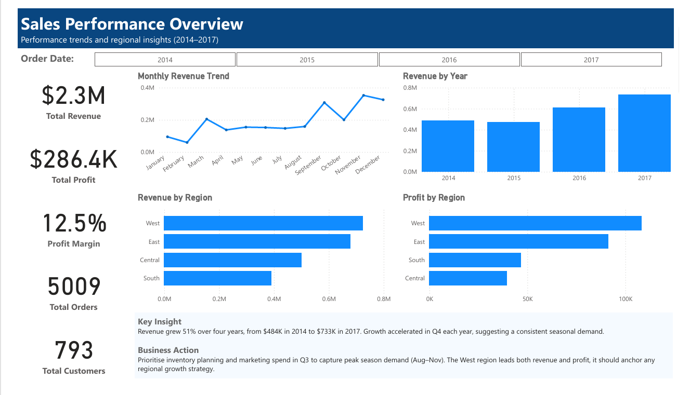
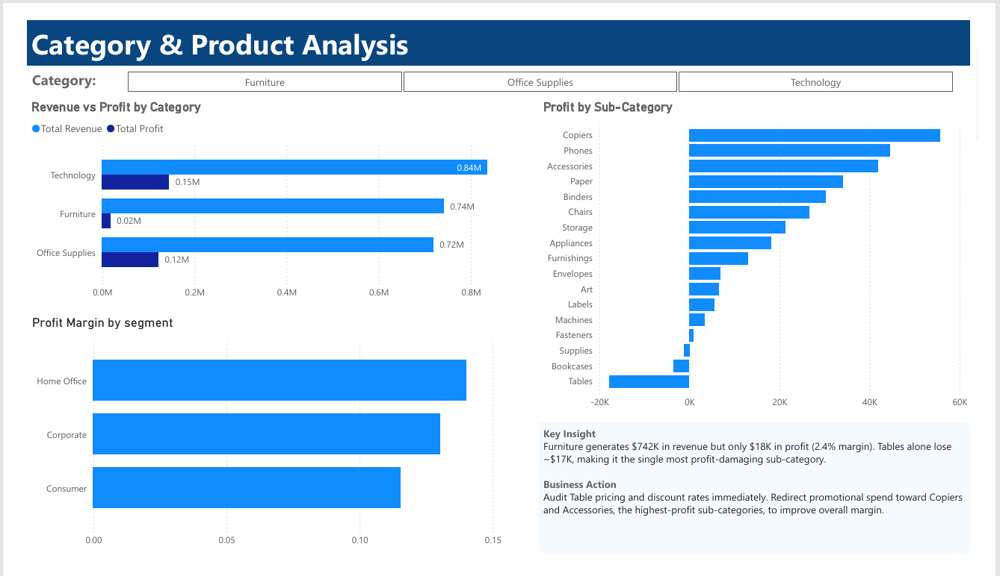
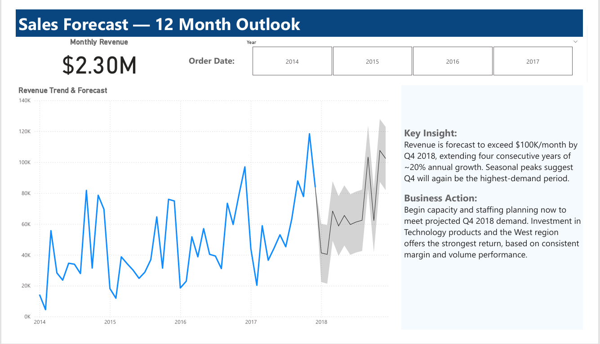

# 📊 Superstore Sales Forecasting — SQL + Power BI

# Data Analytics Portfolio | Ilham Oussanna

---

## 📌 Project Overview

This project analyses four years of US retail sales data (2014–2017) from the Superstore dataset. The goal was to explore sales trends, identify what is and isn't profitable, and build a 12-month revenue forecast to support business planning.

The analysis was completed in two stages:
- **Stage 1 — SQL (PostgreSQL):** 8 queries to extract KPIs, regional breakdowns, category profitability, monthly trends, and customer segment margins
- **Stage 2 — Power BI:** A 3-page interactive dashboard covering Sales Performance, Category Analysis, and a 12-Month Forecast

---

## 🗂️ Repository Structure

```
superstore-sales-forecasting/
│
├── superstore_analysis.sql         # All 8 SQL queries with comments
├── superstore_report.docx          # Full written analysis report
├── superstore_dashboard.pdf        # Power BI dashboard export (3 pages)
├── superstore_dashboard.pbix       
├── superstore_analysis.sql         # All 8 SQL queries with comments
├── screenshots/
│   ├── page1_sales_overview.png
│   ├── page2_category_analysis.png
│   └── page3_sales_forecast.png
└── README.md
```

---

## 🛠️ Tools Used

| Tool | Purpose |
|------|---------|
| PostgreSQL | Data storage, querying, and exploration |
| Power BI Desktop | Dashboard building and forecasting |
| Microsoft Word | Written analysis report |

---

## 📐 Dataset

- **Source:** [Superstore Sales Dataset](https://www.kaggle.com/datasets/vivek468/superstore-dataset-final) — Kaggle
- **Period:** January 2014 – December 2017
- **Records:** 9,994 order lines
- **Key fields:** `order_date`, `sales`, `profit`, `discount`, `category`, `sub_category`, `region`, `segment`, `customer_id`

---

## 🔍 SQL Analysis

Eight queries were written in PostgreSQL to answer specific business questions:

| # | Query | Business Question |
|---|-------|------------------|
| 1 | Business Overview KPIs | What are the headline revenue, profit, orders, and customer totals? |
| 2 | Revenue & Profit by Category | Which product categories are most and least profitable? |
| 3 | Revenue & Profit by Region | Which regions generate the most revenue and profit? |
| 4 | Monthly Revenue Trend | How does revenue fluctuate month by month? |
| 5 | Monthly Revenue by Category | How do category revenues trend over time? |
| 6 | Revenue & Profit by Sub-Category | Which sub-categories are profit drivers or loss-makers? |
| 7 | Annual Revenue Summary | What is the year-over-year growth trend? |
| 8 | Profit Margin by Segment | Which customer segments are most margin-efficient? |

---

## 📊 Dashboard Pages

### Page 1 — Sales Performance Overview



KPI cards, monthly revenue trend, revenue by year, and regional breakdowns for revenue and profit.

> **Key Insight:** Revenue grew 51% over four years, from $484K in 2014 to $733K in 2017. Growth accelerated in Q4 each year, suggesting a consistent seasonal demand pattern.

> **Business Action:** Prioritise inventory planning and marketing spend in Q3 to capture peak season demand (Aug–Nov). The West region leads both revenue and profit — it should anchor any regional growth strategy.

---

### Page 2 — Category & Product Analysis



Revenue vs Profit by Category, Profit by Sub-Category, and Profit Margin by Segment.

> **Key Insight:** Furniture generates $742K in revenue but only $18K in profit (2.4% margin). Tables alone lose ~$17K, making it the single most profit-damaging sub-category.

> **Business Action:** A review of Table pricing and discount rates would be a logical next step. Redirect promotional spend toward Copiers and Accessories — the highest-profit sub-categories — to improve overall margin.

---

### Page 3 — Sales Forecast (12-Month Outlook)



Revenue trend from 2014–2017 with a Power BI 12-month forecast and confidence interval.

> **Key Insight:** Revenue is forecast to exceed $100K/month by Q4 2018, extending four consecutive years of ~20% annual growth. Seasonal peaks suggest Q4 will again be the highest-demand period.

> **Business Action:** Begin capacity and staffing planning now to meet projected Q4 2018 demand. Investment in Technology products and the West region offers the strongest return, based on consistent margin and volume performance.

---

## 📈 Key Findings

- **51% revenue growth** from 2014 ($484K) to 2017 ($733K)
- **Q4 is consistently the strongest period** — November and December peak every year
- **West region leads** on both revenue ($725K) and profit ($108K)
- **Technology and Office Supplies** both achieve ~17% profit margins
- **Furniture earns only 2.5% margin** despite being the second-highest revenue category
- **Tables lose ~$17K** over the four-year period — likely driven by excessive discounting
- **Home Office customers** are the most margin-efficient segment at ~14%
- **Revenue forecast to exceed $100K/month** by Q4 2018

---

## ⚠️ Limitations

- Dataset covers 2014–2017 only; forecast is based on a short historical window
- The dataset is fictional — findings are directional rather than real-world actionable
- A full discount impact analysis was outside the scope of this project but would add further value

---

## 👤 Author

**Ilham Oussanna** — Junior Data Analyst   
🔗 [LinkedIn](https://www.linkedin.com/in/ilham-o-89372a274)

---

*Dataset source: [Superstore Dataset on Kaggle](https://www.kaggle.com/datasets/vivek468/superstore-dataset-final)*
